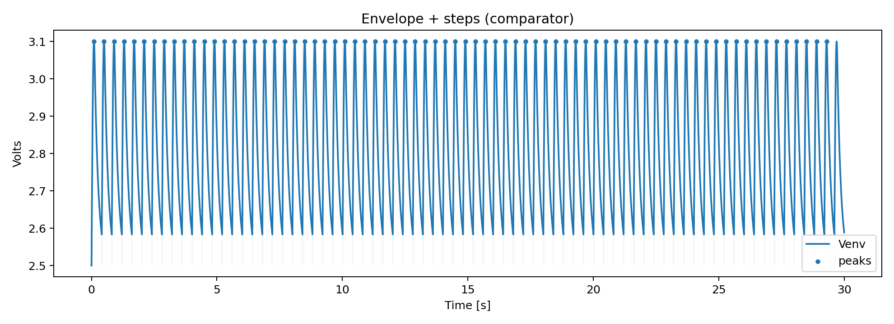

# Smart Run Sole — Analog stride sensor + wear index

A shoe‑insole flex‑sensor front end that extracts **steps**, **cadence**, and a **Wear Index** indicating when your shoes are due for replacement.  
Analog chain: instrumentation → band‑pass → precision envelope → Schmitt comparator.  
One Python script turns exported waveforms into plots and CSV metrics.



---

## What it does

- **Detects steps** with clean digital edges from an analog flex sensor  
- **Cadence** (steps per minute) from edge timing  
- **Stride “power”** from per‑step envelope peaks  
- **Wear Index** = peak / baseline (first minute) → pace‑aware shoe‑wear score  
- Analysis produces ready‑to‑share **PNGs** and **CSVs**

---

## Hardware summary

1. **Bridge + gain (~×21)** using op‑amp instrumentation stage  
2. **AC‑coupled band‑pass (~1–10 Hz)** centered at **Vref ≈ 2.5 V**  
3. **Precision rectifier + RC envelope** (τ ≈ 150 ms)  
4. **Schmitt comparator** (≈0.45 V hysteresis) → clean step pulse

Single‑supply **+5 V**. Envelope and comparator referenced to **Vref** (buffered).

---

## Wear Index (definition)

For step *i* with envelope peak `p_i` and baseline `B`  
(median of the **first minute** *or* **first 100 steps**, whichever comes first):

`WearIndex_i = p_i / B`

**Session score** (also written to `metrics.csv` as `wear_index_last_min`):  
median `WearIndex_i` over the **last minute** of the run.

**Heuristic:** sustained **> 1.30** ⇒ shoe notably softer / over‑bending → time to replace.  
*Baselines are pace and surface dependent; keep separate baselines per **cadence band** (e.g., 140–160, 160–180 spm) and note surface (track/asphalt).*

---

## Quick start (analysis)

**Export from LTspice**
- Plot `V(venv)` and `V(vcmp)` (optionally `V(vref)`) plus **time**
- Waveform Viewer → **File → Export data as text…** (or save as `.xlsx`)

**Run the analyzer**
```bash
# from the repo root, pass the path to your exported file
python analysis/smartsole_run.py "path/to/your_export.xlsx"
```
The script auto‑detects columns and thresholds, computes steps/cadence/peaks, and writes the outputs below.

---

## Outputs

All files are generated into the `outputs/` folder. **No manual edits required; just run the script and open these files.**

- **`venv_timeseries.png`** – Envelope (Venv) over time with peak markers and faint step lines
- **`cadence_over_time.png`** – Cadence (steps per minute) vs time
- **`peaks_hist.png`** – Histogram of relative peak height *(peak − baseline)*, with plain tick labels
- **`metrics.csv`** – One‑row session summary with:
  - `source_file` – analyzed file name
  - `detector_method` – comparator or envelope mode used
  - `num_steps`, `mean_cadence_spm`, `std_cadence_spm`
  - `median_peak_V`, `baseline_peak_V`
  - `median_wear_index` – median of `p_i / B` over the session
  - `wear_index_last_min` – session wear score (median `p_i / B` over the last minute)
- **`peaks_timeseries.csv`** – Per‑step table:
  - `time_s` – timestamp of the detected peak
  - `peak_V` – envelope peak (absolute volts)
  - `peak_V_rel` – peak relative to baseline *(peak − baseline)*
  - `cadence_spm` – instantaneous cadence around that step
  - `wear_index` – `p_i / B` for that step

---

